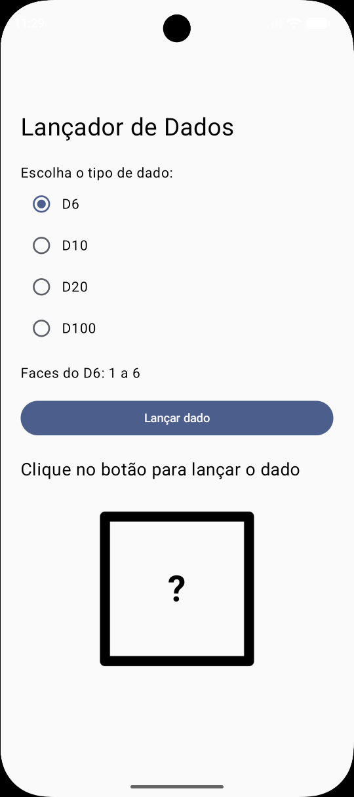
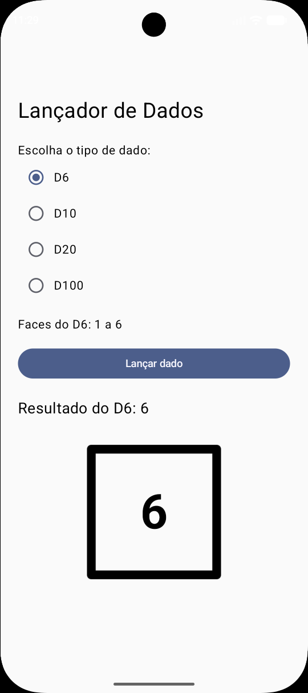
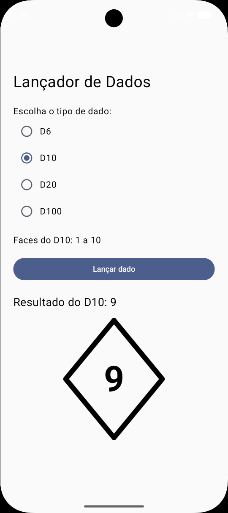
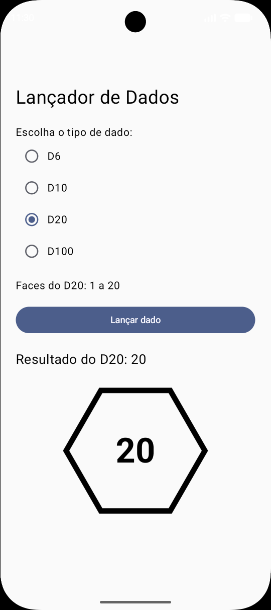
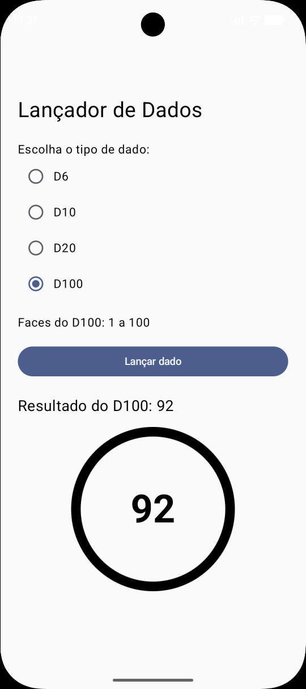

# Lancador de Dados (Android)

Aplicativo Android feito em **Kotlin + Jetpack Compose** para simular lancamentos de dados RPG.

## Objetivo
Permitir que o usuario escolha um tipo de dado (`D6`, `D10`, `D20`, `D100`) e gere um valor aleatorio valido ao clicar no botao.

## Erro original do projeto
A versao inicial tinha apenas o `D6`, com a logica:

```kotlin
Random.nextInt(6)
```

Esse codigo gera valores de **0 a 5**, ou seja:
- podia sair `0` (invalido para dado);
- nunca saia `6`.

## Como foi consertado
A logica passou a usar intervalo com inicio e fim corretos:

```kotlin
Random.nextInt(1, dadoSelecionado.sides + 1)
```

Assim, cada dado agora gera corretamente:
- `D6`: `1..6`
- `D10`: `1..10`
- `D20`: `1..20`
- `D100`: `1..100`

## O que foi adicionado
- Selecao de tipo de dado por `RadioButton`.
- Suporte aos dados `D6`, `D10`, `D20` e `D100`.
- Exibicao do resultado apos clique no botao **Lancar dado**.
- Exibicao visual por imagem para cada tipo de dado.
- Sobreposicao do numero sorteado no centro do icone do dado.

## Como foi implementado
1. Criada estrutura `DiceOption` com:
   - `label` (nome do dado);
   - `sides` (quantidade de faces);
   - `drawableRes` (imagem do dado em `res/drawable`).
2. Montada lista fixa com os quatro dados.
3. No clique do botao, sorteio feito com `Random.nextInt(1, sides + 1)`.
4. Renderizacao da imagem do dado selecionado com `Image`.
5. Numero exibido por cima da imagem usando `Box` com alinhamento central.

## Recursos visuais (imagens)
Colocadas em `app/src/main/res/drawable/`:
- `d6_quadrado.png`
- `d10_diamante.png`
- `d20_hexagonal.png`
- `d100_circulo.png`

## Estrutura principal
- Tela e logica: `app/src/main/java/carvalho/zanini/ponderada1/MainActivity.kt`

## Como executar
1. Abrir o projeto no Android Studio.
2. Sincronizar o Gradle.
3. Rodar no emulador ou dispositivo Android.

## Screenshots

### Tela inicial


### D6 selecionado e resultado


### D10 selecionado e resultado


### D20 selecionado e resultado


### D100 selecionado e resultado

